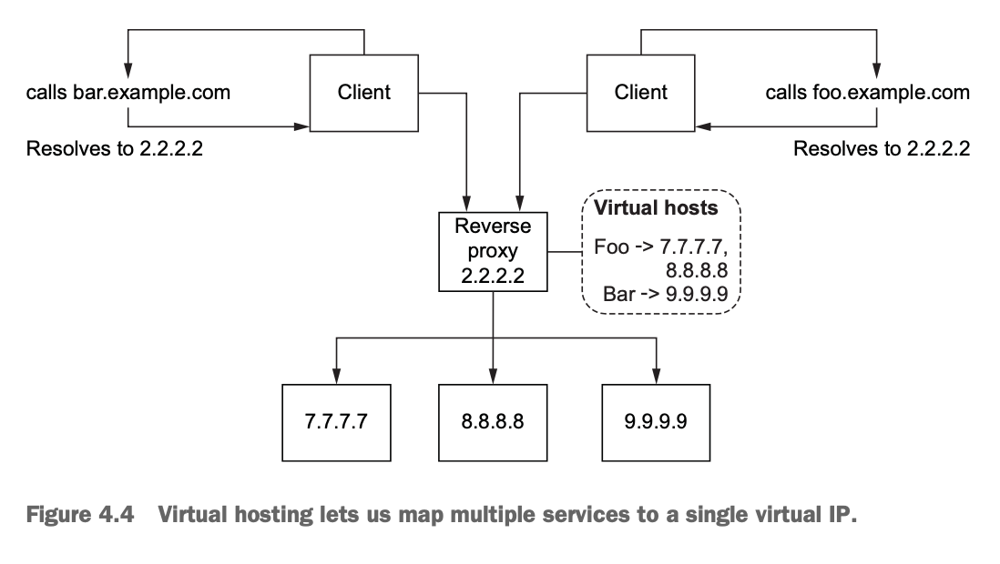
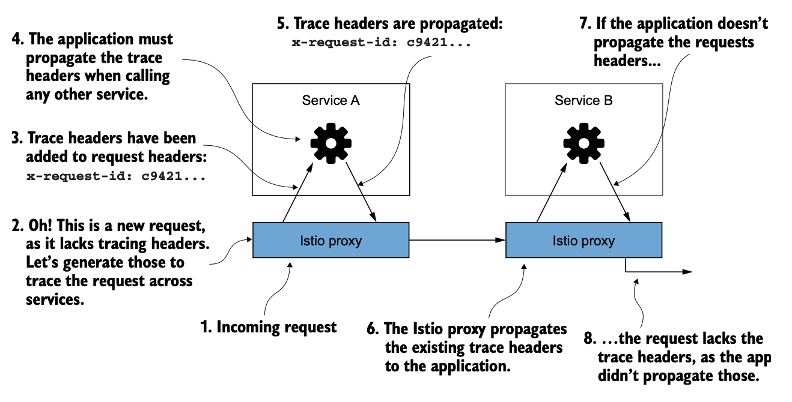
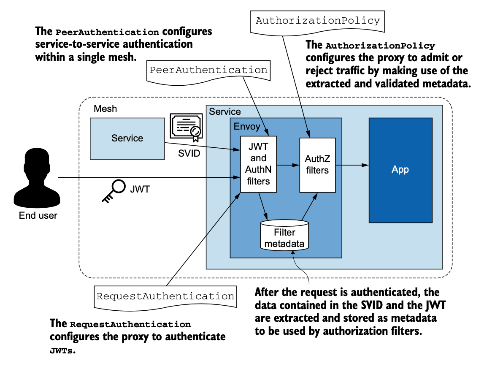

# Istio in Action

[Book](https://www.manning.com/books/istio-in-action)

- [1. Intro to Istio Service Mesh](#1-intro-to-istio-service-mesh)
- [2. First Steps with Istio](#2-first-steps-with-istio)
- [3. The Envoy Proxy](#3-the-envoy-proxy)
- [4. TCP Traffic](#4-tcp-traffic)
- [5. Traffic control](#5-traffic-control)
- [6. Resilience](#6-resilience)
- [7. Observability](#7-observability)
- [8. Observability: Visualising network behaviour with Grafana, Jaeger, and Kiali](#8-observability-visualising-network-behaviour-with-grafana-jaeger-and-kiali)
- [9. Securing microservice communication](#9-securing-microservice-communication)
- [10. tbc](#10-tbc)
- [11. tbc](#11-tbc)
- [12. Scaling Istio](#12-scaling-istio)
- [13. Incorporating VM Workloads into the Mesh](#13-incorporating-vm-workloads-into-the-mesh)
- [14. Extending Istio on the Request Pass](#14-extending-istio-on-the-request-pass)
- [Appendix A: Customising Istio installation](#appendix-a-customising-istio-installation)
- [Appendix B: Istio's sidecar and its injection options](#appendix-b-istios-sidecar-and-its-injection-options)
- [References](#references)

## 1. Intro to Istio Service Mesh

- **Service mesh**
  - A distributed application infrastructure
  - Handles network traffic on behalf of application
  - Application does not know about the mesh (i.e. it is *transparent*)
- Service mesh data plane
  - Traffic goes through here
  - Data plane establishes, secures and controls traffic
- **Envoy**: an L3/L4 proxy
- **Envoy proxy** supports:
  - Retries
  - Timeouts
  - Circuit-breaking
  - Client-side load balancing (adaptive and zone-aware)
  - Service discovery
  - Security
  - Metrics collection w/o framework or language dependencies e.g.
    - requests/second
    - no. of failures
    - no. of circuit-breaking events
  - Collect distributed tracing spans (i.e. trace each step of a request)
- Envoy proxy as a sidecar:
  - All network traffic to/from an application goes through the proxy
- **Istio**
  - Open source version of Google, IBM and Lyft's mesh
  - Istio's data plane helps deploy Envoy as a sidecar to applications
  - Implements control points at each application to enable networking
    - This enables canary releases, dark launches, gradual rollouts
  - **Security**
    - Traffic encrypted by default
    - Key management
    - Certificate issuance (+ workload identity embedded)
    - Certificate installation
    - Certificate rotation
    - mTLS out-of-the-box
- **Mesh vs. ESB (Enterprise Service Bus)**
  - ESB requires service integration gatekeepers => creates silos
  - ESB is very centralised deployment
  - ESB mixes app networking and service mediation concerns
  - ESB implementation is (often) complicated and proprietary
- **Mesh vs. API Gateway**
  - API Gateway provides public endpoints for an org's public APIs
  - API Gateway provides:
    - security
    - rate limiting
    - quota management
    - metrics collection
    - specs
    - user registration
    - billing, etc.
  - API Gateway *may* be used to centralise (for internal APIs):
    - security
    - policy
    - metrics collection
  - API Gateway drawbacks:
    - Centralised deployment, hence:
      - Application cannot secure transport layer
      - To secure transport, app needs to participate in security config
    - Two hops needed for inter-app comms:
      - one hop to the API gateway
      - one hop to the target app
    - (In general) No circuitbreaker or bulkheading 
- Service mesh drawbacks
  - Additional middleware (i.e. Envoy proxy)
  - Knowledge of Envoy proxy required (for debugging)
  - Proper tenancy and isolation models required
    - else Mesh becomes single point of failure

## 2. First Steps with Istio

- **Istio Control Plane** provides:
  - APIs for operators to configure Routing/Resilience behaviour
  - APIs for the Data Plane to consume their configuration
  - APIs for specifying Usage Policies
  - Service Discovery abstraction for the Data Plane
  - Certificate issuance and rotation
  - Workload identity assignment
  - Unified telemetry collection
  - Service-proxy Sidecar injection
  - Network boundaries specs
- **Istio Control Plane components**
  - *Istio Pilot (istiod)* - Converts Istio config => Sidecar proxy config
    - **Istio uses K8s CRDs**
    - Istio's data plane API *implements* Envoy discovery API
    - Workload Identity
      - Uses SPIFFE (Secure Production Identity Framework for Everyone)
      - mTLS w/o application being aware of certs/keys
  - *Ingress Gateway*
    - Traffic into the mesh
  - *Egress Gateway*
    - Traffic out of the mesh

## 3. The Envoy Proxy

- Envoy proxy provides:
  - Service discovery
    - *Eventually consistent* by design
  - Load balancing
    - *Locality-aware* (traffic cannot cross locality boundaries)
    - LB types:
      - Random
      - Round robin
      - Weighted, least request
      - Consistent hashing (sticky)
  - Traffic and Request Routing
  - Traffic Shifting and Shadowing
    - %-based traffic split (enables canary releases)
- Envoy protocol support OOTB:
  - HTTP 1.1
  - HTTP 2
  - gRPC
- Envoy protocol extensions:
  - AMQP
  - MongoDB
  - DynamoDB
- **Envoy dynamic config APIs**
  - Listener discovery service (LDS)
  - Route discovery service (RDS)
  - Cluster discovery service (CDS)
  - Endpoint discovery service (EDS)
  - Secret discovery service (SDS)
  - Aggregate discovery service (ADS)

## 4. TCP Traffic

- Traffic ingress concepts:
  - For high availability: `Client -> Virtual IP -> Service(s)`
  - Virtual IP maps to a *reverse proxy*

- **Virtual hosting**
  - Allows mapping of multiple services into a single virtual IP

- **Istio ingress gateway**
  - Guards and controls access to cluster from traffic outside of cluster
  - Handles load balancing and virtual-host routing
  - Ingress traffic controlled by two K8s resources:
    - *Gateway* (L4/L5 concerns): expose port(s) and set host(s)
    - *VirtualService* (L7 concerns): defines how a client talkes to a service through its FQDN, which version of a service, routing properties (retries, timeouts, etc.)
  - Terminates TLS/SSL traffic before passing through to backend services
- **Service Name Indication (SNI)**
  - Allows routing HTTPS traffic from client to the correct host and present the right certificate
  - How? Client first identifies which service to reach using the *ClientHello* part of the TLS handshake
- Istio operational tips
  - Split-gateway responsibilities
  - Gateway injection

## 5. Traffic control

- **Traffic shifting**
  - e.g. Set 90% to Service A and 10% traffic to Service B
- **Traffic mirroring**
  - Copy Prod-level traffic from A to B to test behaviour and performance
- **Traffic out of the Mesh**
  - *Default*: Allow all traffic out of mesh
  - Block outbound traffic to increase security
- Canary release
  - [Flagger](https://flagger.app) allows user to specify how to perform release, when to open release to more users, and when to roll back
  - Flagger creates config to drive the release

## 6. Resilience

- **Client-side load balancing** 
  - [Fortio](https://github.com/fortio)
- Istio's **Locality-aware load balancing**
  - Route requests based on workload location (region, AZ, etc.)
  - Priority given to services that are closer
- *Request hedging*
  - When a request times out, Istio sends another request to "race" the original 
  - Can be setup using the `EnvoyFilter` resource
- Guarding against slow services with *connection-pool* control
- Guard against unhealthy services with *outlier detection*

## 7. Observability

- Observability tools:
  - Prometheus
    - "Pulls" metrics from targets rather than expecting them to "push" metrics to it
  - Grafana
  - Kiali
    - Pulls metrics from Prometheus and creates a run-time graph of the components in a mesh

## 8. Observability: Visualising network behaviour with Grafana, Jaeger, and Kiali

- Istio supports **distributed tracing**
  - Gives insight into the components of a distributed system involved in serving a request
- How does distributed tracing work?
  - Propagate tracing header

- Trace sampling
- Force traces
- Custom tags

## 9. Securing microservice communication

- Protecting user data requires:
  - Authentication and authorisation of user before accessing a resource
  - Encryption of data in transit 
- **How Istio implements SPIFFE**
  - SPIFFE identity is *spiffe://trust-domain/path*
  - *trust-domain* is the issuer of identity
  - *path* uniquely identifies the workload
- Istio's custom resources for service proxy (Envoy):
  - *PeerAuthentication* resource authenticates service-to-service traffic
  - *RequestAuthentication* resource authenticates end-user credentials against the servers that issue them
  - *AuthorizationPolicy* resource accepts or rejects requests based on data from the previous two resources

- **Auto mTLS**

## 10. tbc

tbc

## 11. tbc

tbc

## 12. Scaling Istio

- Istio multi-cluster deployment models
  - Primary-remote (single/shared control plane)
  - Primary-primary (replicated control plane)
  - External control plane
- **Cross-Cluster Discovery**
  - Service Accounts
    - identity to non human clients
  - Service Account Tokens
    - auto-generated for each service account
    - represent identity claim
    - formatted as JWT
    - injected by K8s into Pods that use tokens to auth with API server
  - Roles & Cluster Roles
    - a set of permissions for identity
- **Common trust between clusters**
  - Clusters in a flat network?
    - Workloads simply connect via IP
  - Clusters in different networks?
    - Use special **Istio ingress gateways** located at edge of the network and proxy cross-cluster traffic
    - Install intermediate certs in the `istio-system` namespace
- **Istiod**
  - Validates and approves CSRs stored in K8s
  - CSRs are submitted to external CA through one of the following:
    - cert-manager
    - custom K8s controller
  - Cert signed by external CA is stored in K8s CSR
  - Istiod forwards cert to workload using Secret Discovery Service (SDS)
- **Multi-cluster service mesh** setup requirements:
  - Cross-cluster workload discovery
    - Each control plane has access to peer clusters
  - Cross-cluster workload connectivity
    - Configure east-west gateways to route traffic between workloads in different clusters
    - Label each cluster with network info (so Istio knows which network a workload resides in)
  - Cross-cluster trust config
    - Use common root of trust that issues intermediate certs of the opposite clusters
   
## 13. Incorporating VM Workloads into the Mesh

- VM joining Mesh requirements:
  - Install sidecar proxy
  - Configure proxy to connect to *istiod* and receive mesh config
  - Provide *identity token* to the VM for istiod authentication
- K8s high-availability setup for containers:
  - *Deployments*
  - *Pods*
- Istio high-availability setup for VMs:
  - *WorkloadGroup* similar to K8s Deployments
  - *WorkloadEntry* similar to K8s Pods
- Workload *autoregistration* (recommended over WorkloadEntry)
  - New workloads join mesh automatically
- Health checks when Workload joins a Mesh:
  - *Readiness probe* - is Workload ready to receive traffic?
  - *Liveness probe* - is App healthy?
- **DNS Proxy**
  - Configured by *istiod* with the services known to it
  - `istio-agent` generates shorter variations of the hostnames
  - Entries (in DNS proxy) are used to resolve in-cluster service hostnames
  - For queries of non-cluster hostnames (e.g. public domains) the resolution falls back to the nameservers
- **K8s** workload init:
  - Installing proxy: Manual injection using `istiod` or webhook
  - Configuring proxy: During sidecar injection
  - Workload identity: Service account token injected into Pod by K8s
  - Health check: Readiness and liveness probes by K8s
  - Registration: Handled by K8s
  - DNS resolution: In-cluster DNS server
- **VM** workload init:
  - Installing proxy: Manual install
  - Configuring proxy: Generate config from a *WorkloadGroup* using `istioctl` and transfer to the VM with the proxy
  - Workload identity: Manual - transfer svc token to VM
  - Health check: Configured in the *WorkloadGroup*
  - Registration: Auto - as members of *WorkloadGroup*
  - DNS resolution: Configured by `istiod`

## 14. Extending Istio on the Request Pass

- Envoy has *network filters* for the below protocols:
  - MongoDB 
  - Redis 
  - Thrift
  - Kafka
  - HTTP Connection Manager (HCM)
- Filters can be *chained* to operate on a stream in a sequence
- HCM supports HTTP filters:
  - Cross-origin resource sharing (CORS)
  - Cross-site request forgery prevention (CSRF)
  - ExternalAuth
  - RateLimit
  - Fault injection
  - gRPC/JSON transcoding
  - Gzip
  - Lua
  - Role-based access control (RBAC)
  - Tap
  - Router
  - WebAssembly (Wasm)

## Appendix A: Customising Istio installation

tbc

## Appendix B: Istio's sidecar and its injection options

tbc

## References

Envoy:
- Envoy documentation and comparison: http://bit.ly/2U2g7zb
- Turbine Labs' switch from Nginx to Envoy: http://bit.ly/2nn4tPr
- Cindy Sridharan's initial take on Envoy: http://bit.ly/2OqbMkR
- Why Ambassador chose Envoy over HAProxy and Nginx: http://bit.ly/2OVbsvz

Liveness checks and auto-healing:
- Azure implements automatic instance repairs for VM scale sets: http://mng.bz/0wrx
- Amazon Web Services implements health checks for auto-scale group instances: http://mng.bz/KB4K
- Google Cloud Platform implements health checking and auto-healing for man-aged instance groups: http://mng.bz/9KNl

Istio:
- DNS proxy: https://istio.io/latest/blog/2020/dns-proxy

Prometheus:
- Pull metrics vs. Push metrics: https://thenewstack.io/exploring-prometheus-use-cases-brian-brazil/
